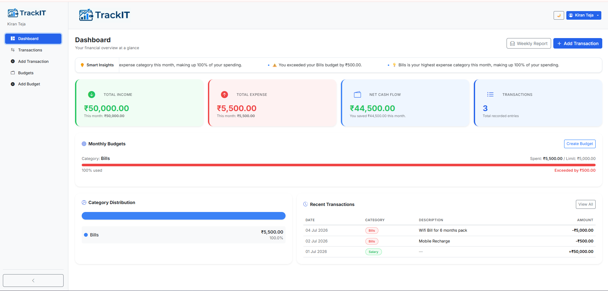
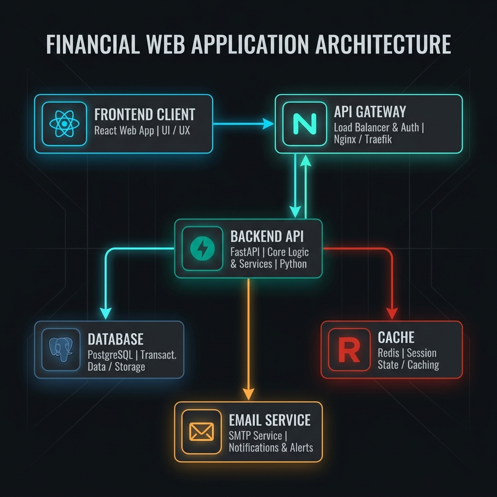
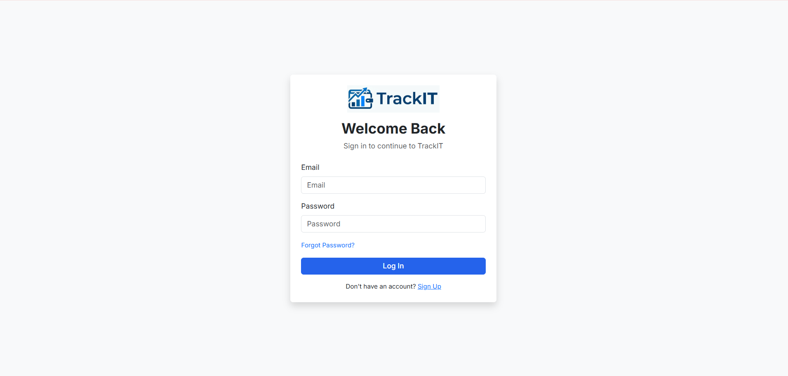
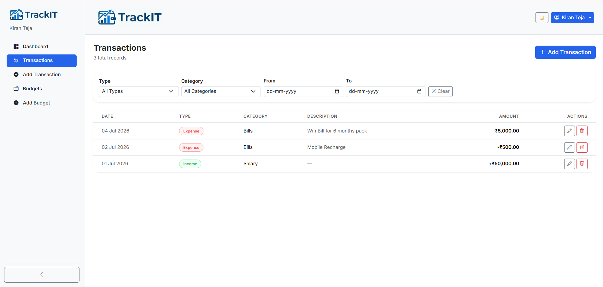
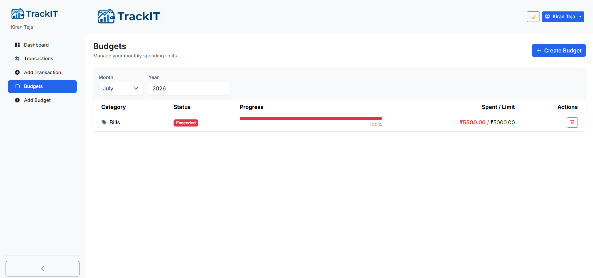
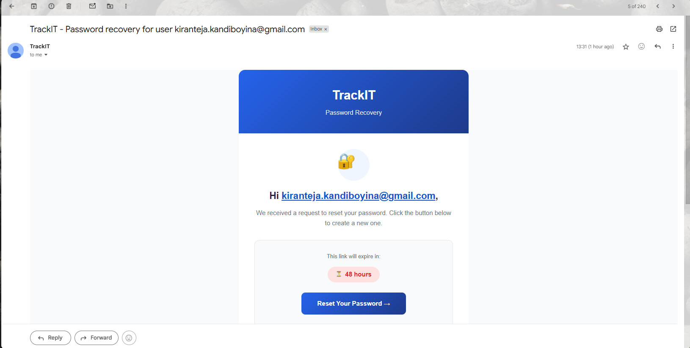

# TrackIT — The "Smart" Mini-Ledger
**Bytex Financial Ltd. Full Stack Engineer Challenge Submission**

## Overview
TrackIT is a lightweight, full-stack financial ledger application designed to help individuals track their income and expenses, visualize their spending, set category-based budgets, and receive automated insights and email notifications. 

It was built with a specific focus on robust architecture, polished aesthetics, and demonstrating technical depth to fulfill the requirements of the **Bytex Challenge**.

---

## 🌐 Live Demo

**Application:** https://trackit.doitapp.xyz
**API Documentation (Swagger):** https://api.trackit.doitapp.xyz/docs

> **Demo Account**
>
> **Email:** `admin@trackit.com`  
> **Password:** `password1234`

---

## 🏗️ System Architecture

### How it works:
* **Frontend Client (React 19 + Vite)**: A lightning-fast, single-page application built with React and TypeScript. It communicates securely via REST APIs (using Axios) with JWT authentication.
* **Backend API (FastAPI)**: A high-performance Python backend that handles business logic, JWT validation, and complex financial aggregations.
* **Database Layer (PostgreSQL)**: The primary source of truth, storing users, transactions, and category budgets using SQLAlchemy ORM.
* **Caching Layer (Redis)**: Intercepts heavy read requests (like dashboard summaries and all-time averages). It dramatically reduces database load and is intelligently invalidated on any write operation.
* **Notification Engine (Brevo SMTP)**: Listens for specific budget thresholds or trigger events on the backend, generating and dispatching rich HTML emails via Jinja2 templates.

---

## 🎨 Screenshots

| Feature | Screenshot |
|---------|------------|
| **Login Page** |  |
| **Dashboard & Insights** |  |
| **Transaction Management** |  |
| **Category Budgets** |  |
| **Email Alert System** |  |

---

## 🚀 The Catch: Meeting the Challenge

### 1. The Unique Twist
Instead of just a simple CRUD ledger, TrackIT implements two unique technical twists:
* **Intelligent Spending Pattern (Redis Caching)**: When a user visits the dashboard, the backend computes their all-time average daily spending. If a new transaction wildly exceeds this average (≥ 3x), an "Intelligent Insight" warning dynamically appears. To ensure this doesn't crush the PostgreSQL database, complex aggregations are cached in Redis and invalidated precisely on transaction mutations.
* **Dynamic Category Budget Alerts**: Users can set budgets per category. If an expense pushes a category over its limit, the backend's notification service intercepts the transaction and automatically fires off a Jinja2-templated, category-specific HTML warning email via SMTP.

### 2. Production Polish
* **Clean UI**: Custom, responsive CSS design system (no Tailwind) featuring a dark theme, smooth micro-animations, and a completely jump-free collapsible sidebar.
* **Structured Code**: Strictly enforced linting pipelines using **Biome** (Frontend) and **Ruff + Mypy** (Backend). 
* **Dockerized Environment**: The entire stack (React, FastAPI, Postgres, Redis) spins up flawlessly via a single `docker-compose.yml`.

---

## 🤖 AI Collaboration & Engineering Judgment

This project was built leveraging AI (GitHub Copilot and Claude) as a *co-pilot*, not an *autopilot*. AI was exceptional at accelerating boilerplate, scaffolding React components, and generating SQLAlchemy models. 

However, relying entirely on AI output introduced subtle, architecture-breaking bugs. Here is where the AI fell short, and how human engineering judgment stepped in to fix it:

### 1. The FastAPI Trailing Slash Trap
* **Where AI Fell Short**: When generating the authentication flow, the AI built the backend route as `@router.post("/reset-password/")` (with a trailing slash) but the frontend `axios` call targeted `/reset-password` (without the slash). 
* **The Human Fix**: This resulted in FastAPI automatically issuing a `307 Temporary Redirect`. Because browsers handle POST redirects poorly, this dropped the JSON payload and caused a catastrophic CORS preflight failure in production. I recognized the redirect trap, removed the trailing slash from the backend route, and restored the critical security flow.

### 2. The "Hallucinated" Router Configuration
* **Where AI Fell Short**: The AI successfully generated the backend JWT logic for email verification, and even built a beautiful `VerifyEmail.tsx` frontend page. However, it completely "hallucinated" the integration, forgetting to actually import and register the route inside the React Router (`main.tsx`).
* **The Human Fix**: Clicking the verification link in the email resulted in a hard 404. I tracked the disconnect down to the routing layer, registered `<Route path="/verify-email" element={<VerifyEmail />} />`, and bridged the gap between the isolated AI-generated files.

### 3. Global Configs vs. Dynamic State
* **Where AI Fell Short**: The AI suggested wiring the budget email alerts to a global `.env` variable (`MONTHLY_BUDGET_LIMIT=5000`). 
* **The Human Fix**: I recognized that hardcoding a global limit for a multi-user ledger makes zero architectural sense. I scrapped the AI's `.env` approach, authored a dynamic hook inside the transaction creation endpoint (`transactions.py`), and wired the notification service directly into the database `Budget` model. Now, alerts trigger dynamically based on actual user-defined category limits.

---

## 🛠️ Local Development & Deployment

For detailed instructions on local development, linting, Docker deployment, and the CI/CD pipeline, please refer to the **[DEVELOPMENT_GUIDE.md](./DEVELOPMENT_GUIDE.md)**.

### Quick Start
1. Clone the repository and configure your `.env` file.
2. Run `docker compose up -d --build`.
3. The database migrations run automatically. 
4. Access the frontend at `http://localhost:5173`.
5. Access the backend API at `http://localhost:8000/docs`.

**Default Test Account:**
- **Email**: `admin@trackit.com`
- **Password**: `password1234`
